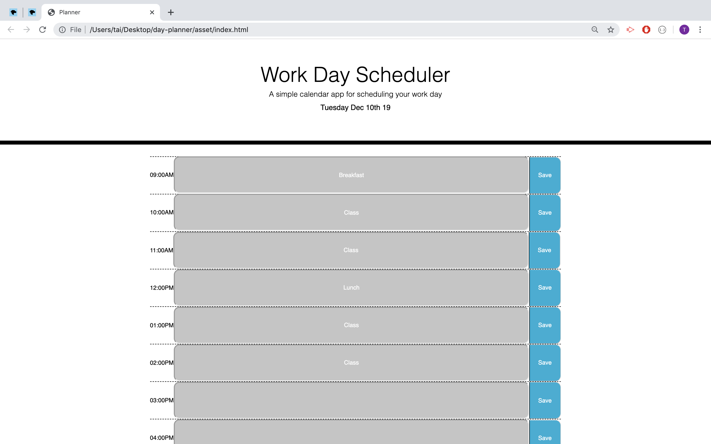

# day-planner

## Summary
This is a day planner with time slots from 9AM-5PM. It's allow users to save the infomation from the block to local storage. The day planner has three colors. Gray color shows the time slot is not available, green color means available and red is at current hour.

## Techonologies Used
- Bootstrap - used to create components in a faster pace.
- CSS - used to style the layout of the page.
- GitHub - used to push and commit the page.
- Javascript - to create function.
- Moment.js - to format current time.
- Localstorage - to save data from the web.
- JSON.stringify - to push all data into an array.
- JSON.parse - to convert a string to an objact.


## Site Pictures


## Code Snippet
```html
var saveButton = document.getElementsByClassName("saveBtn");
var display;
var data = {};
var input;

// saveInput()
$('.saveBtn').on("click", function(event){
    event.preventDefault()
    var timeBlock = $(this).siblings().val() // To get the sibling value 
    var button = $(this).data("input") // To get data input of the button
    data[button] = timeBlock; // set the data to get 
    localStorage.setItem("time-block", JSON.stringify(data));
    // saveInput()
    console.log($(this).siblings().val())
    console.log(data)

})

function loadItems() {
    var dataFromStrorage = JSON.parse(localStorage.getItem("time-block"));
    nineAm.setAttribute("value", dataFromStrorage.nine);
    tenAm.setAttribute("value", dataFromStrorage.ten);
    eleAm.setAttribute("value", dataFromStrorage.ele);
    twePm.setAttribute("value", dataFromStrorage.twe);
    onePm.setAttribute("value", dataFromStrorage.one);
    twoPm.setAttribute("value", dataFromStrorage.two);
    threePm.setAttribute("value", dataFromStrorage.three);
    fourPm.setAttribute("value", dataFromStrorage.four);
    fivePm.setAttribute("value", dataFromStrorage.five);
}
loadItems();
```
This code snippet to save data to local storage and also pull data from local storage.

## Author Links
[LinkedIn](www.linkedin.com/in/tu-tai-le-2a9646139)
[GitHub](https://github.com/TaiLe96)